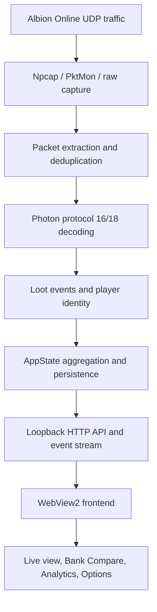

# Albion Loot Logger v9.0.07

Albion Loot Logger is a Windows desktop application that captures Albion Online loot events,
groups them by player and item, saves sessions, imports Albion bank exports, and compares what
players looted with what they deposited.

This package contains the working v9.0.07 executable, the recovered and unpacked frontend,
native-backend metadata, extracted application icons, documentation, and the patching tools used
to produce the current build.

## Important source-code limitation

The original Go backend source files were **not** stored in the executable and cannot be recovered
exactly from it. The `backend-recovery/` folder contains confirmed build metadata, source-file
names, function/type symbols, JSON field names, and API routes. It is useful for understanding or
reimplementing the backend, but it is not a compilable Go project.

The HTML, CSS, and JavaScript frontend is fully unpacked and editable. It still requires the native
backend HTTP API, packet-capture service, persistence layer, and WebView2 host supplied by the EXE.
Opening `frontend/index.html` directly in a browser only displays the shell; live capture and native
operations will not work.

Statements below marked **inferred** are based on recovered native function names and observable
frontend calls. Everything else is directly present in the recovered application.

## Current build

| Property | Value |
| --- | --- |
| Application version | v9.0.07 |
| Platform | Windows x86-64 GUI executable |
| Native backend | Go, `GOOS=windows`, `GOARCH=amd64`, `CGO_ENABLED=0` |
| Executable size | 7,608,832 bytes |
| Executable SHA-256 | `ed8297a64d6aef3a51d7d02431ddff9bf6d0a87ef33c873af1812b99e8344c33` |
| Embedded frontend | HTML bootstrap plus Base85-encoded, gzip-compressed JSON payload |
| Desktop renderer | Microsoft Edge WebView2 |
| Live packet capture | Npcap, with recovered PktMon/raw-capture fallback code paths |
| Recovered native symbols | 482 functions, 230 types/name entries |
| Recovered native source paths | 19 |
| Recovered API routes | 22 |
| Extracted PNG resources | 7 |

## How the program works

1. Starts a local native backend and an embedded WebView2 window.
2. Detects Albion Online and identifies the active host character.
3. Captures Albion UDP traffic from the local computer.
4. Extracts Photon protocol messages and decodes loot-related events.
5. Resolves item IDs, player identities, guilds, alliances, categories, and icons.
6. Aggregates loot into players and item stacks in the current session.
7. Broadcasts live state and loot events to the frontend.
8. Saves sessions, settings, bank state, and UI preferences.
9. Imports bank exports and optional loot-event TXT files.
10. Compares expected deposits with actual deposits and assigns a status to every item.



## Runtime requirements

### Microsoft Edge WebView2 Runtime

WebView2 renders the interface inside the native Windows window. If WebView2 is missing or damaged,
native startup displays an install/repair message. If it starts but reports a major version below
109, the frontend asks the user to update it.

Download: <https://developer.microsoft.com/microsoft-edge/webview2>

### Npcap

Npcap supplies the packet-capture API used for reliable live capture. Install a current version
with **WinPcap API-compatible Mode** enabled. If Npcap or `wpcap.dll` is missing, incompatible, or
outdated, the program displays an install/update message instead of silently showing no loot.

Download: <https://npcap.com/#download>

Npcap is not bundled because redistribution of its free installer requires a separate OEM licence.

### Albion Online

The logger only sees traffic generated on the same computer. Loot sources are always the host
character and other players; the old source-toggle buttons are intentionally not used.

## Native backend architecture

The confirmed original source-file map is:

| File | Responsibility indicated by recovered symbols |
| --- | --- |
| `main.go` | Process startup, component construction, shutdown, and fatal-error handling |
| `webview2_window_windows.go` | Native Win32 window and WebView2 lifecycle |
| `webserver.go` | Local HTTP API, state responses, SSE stream, and security headers |
| `model.go` | State, loot events, players, items, telemetry, and settings models |
| `settings.go` | Defaults, normalization, loading, saving, and reset behavior |
| `capture_windows.go` | Capture manager, capture selection, process monitoring, and lifecycle |
| `capture_npcap_windows.go` | Npcap loading, device selection, and capture loop |
| `capture_pktmon_windows.go` | Windows PktMon capture implementation |
| `packet_extract.go` | Ethernet/IP/UDP extraction and Albion payload scanning |
| `photon.go` | Photon framing, reliable messages, fragmentation, and protocol-16 decoding |
| `protocol18.go` | Photon protocol-18 decoding and partial recovery |
| `catalog.go` | Item catalog, normalized names, categories, enchantments, and icons |
| `bank.go` | Bank-export delimiter detection, parsing, normalization, and comparison data |
| `lookup.go` | Player/guild lookup, AlbionDB parsing, caching, and health checks |
| `telemetry.go` | Packet/parser counters and capture-health state |
| `process_windows.go` | Albion process discovery |
| `native_save_windows.go` | Native save-file dialog and remembered save location |
| `ipc.go` | Elevated capture-child IPC and batched messages |
| `safety.go` | Panic/error containment and component recovery |

### Startup flow

The recovered symbols indicate this startup flow:

1. `main.main` creates `AppState`, `Catalog`, `EventHub`, `CaptureManager`, and `WebApp`.
2. Persisted state and settings are loaded and normalized.
3. The local web server starts and `waitForWebServer` waits until it is ready.
4. `findInstalledWebView2Runtime` and `loadWebView2Loader` prepare the renderer.
5. `openAppWindow` creates the native window and navigates WebView2 to the local UI.
6. `monitorAlbionProcess` watches for the game and updates `GameStatus`.
7. `CaptureManager.Start` selects and starts an available capture backend.
8. State changes are saved and broadcast through the event hub.

Exact statements and internal ordering are **inferred** because only symbols, strings, and behavior,
not the original Go code, are recoverable.

## Packet-capture and decoding pipeline

### Capture selection

Recovered functions include `startNpcapCapture`, `startPktmonCapture`, `startRawCapture`, and
`startPacketCapture`. Npcap is the intended primary path. PktMon and raw sockets appear to be
fallback/recovery implementations.

Telemetry includes raw packets/bytes, Albion UDP packets/bytes, Photon packets, reliable messages,
protocol-16/18 messages, decoded events, malformed messages, inferred loot events, partial
recoveries, and rejected other-player loot events.

### Packet extraction

`packet_extract.go` handles Ethernet, IPv4, IPv6, UDP, Npcap framing, and scanning for Albion UDP
payloads. `newPacketDeduper` prevents duplicate packets from being processed repeatedly.

### Photon decoding

`PhotonParser` handles reliable messages, fragments, event messages, operation responses, and
loot-tracking cleanup. Both protocol-16 and protocol-18 paths are present. Partial decoders recover
useful fields from messages that cannot be decoded completely.

Recovered loot-related handlers include:

- `processNewCharacter`
- `processNewLoot`
- `processNewLootItem`
- `processAttachItemContainer`
- `processInventoryPutItem`
- `processOtherGrabbedLoot`
- `recoverOtherGrabbedLootP16`
- `recoverOtherGrabbedLootP18`
- `resolveLootSourceName`

### Validation, aggregation, and identity

Names, item IDs, quantities, and sources pass validation helpers before being added.
`AppState.addLoot`, `aggregateLootEvents`, and `recalculatePlayerAggregate` turn events into the
player/item structure exposed to the UI. Item identity includes a normalized item name/ID and
enchantment, so differently enchanted items do not collapse into one row.

The capture manager caches known identities and queues lookups. The lookup service resolves player,
guild, alliance, and guild-member information. Verified roster matches are saved so restored
sessions and Bank Compare can display guild/alliance context.

## Main application state

The backend exposes a `PublicState` snapshot assembled from these areas:

| Area | Important fields |
| --- | --- |
| Session | `session_id`, `session_started`, `started_at`, `updated_at` |
| Game | `running`, process information, server, character, host character |
| Players | name, guild, alliance, items, total quantity, first/last loot |
| Items | ID/name, category, quantity, enchantment, quality, icon, sources, pickup history |
| Bank | loaded flag, rows, filename, import time, deposited amount, status |
| Capture | state, message, last error, interface/process details, telemetry |
| Catalog | found status, categories, refresh time, and item metadata |
| Settings | categories, sorting, display options, capture/UI options |

The backend uses `snapshot` and `copyBankState` so the UI receives stable copies instead of directly
sharing mutable capture state.

## Local HTTP API

| Route | Purpose |
| --- | --- |
| `/api/state` | Full current state snapshot |
| `/api/events` | Server-Sent Events stream for state and loot updates |
| `/api/ui/heartbeat` | Signals that the UI is alive |
| `/api/session/new` | Starts a new loot session |
| `/api/clear` | Clears current loot data |
| `/api/exit` | Requests application shutdown |
| `/api/settings` | Loads/saves application settings |
| `/api/settings/reset` | Restores default settings |
| `/api/capture/restart` | Restarts packet capture |
| `/api/catalog/refresh` | Refreshes the item catalog |
| `/api/catalog/resolve` | Resolves item metadata in batches |
| `/api/gameinfo/items` | Supplies item/catalog information |
| `/api/bank/import` | Imports a bank-export file |
| `/api/bank/clear` | Clears bank state |
| `/api/bank/export/save?region=…` | Saves Bank Compare data with a native dialog |
| `/api/export/save?region=…` | Saves the loot-session TXT export |
| `/api/diagnostics.txt` | Returns diagnostic/capture information |
| `/api/lookup?type=…` | Resolves players, guilds, or alliances |
| `/api/lookup/health` | Reports lookup-service health |
| `/api/open-external` | Opens an approved external URL through the native host |
| `/api/v2/stats/…` | Albion Data price/statistics proxy |
| `/api/v2/stats/prices/…` | Item price lookup for silver estimates |

Methods and payloads should be taken from frontend call sites when reimplementing a route. Most
mutations use `POST`; state, health, diagnostics, lookups, and price data use read requests.

Do not expose the backend port beyond the local computer. The recovered metadata is insufficient
to make strong claims about every authentication or authorization check.

## Frontend architecture

### Packed production frontend

The EXE contains one fixed-size HTML resource. Its bootstrap:

1. Collects `LL835PACK` style chunks and `window.__ll832Parts` script chunks.
2. Decodes the custom Base85 alphabet into bytes.
3. Reads the compressed payload length from the bootstrap.
4. Decompresses gzip data with `DecompressionStream`.
5. Parses a JSON object containing `styles`, `pre`, and `js`.
6. Injects styles, then pre-scripts, then the main application JavaScript.
7. Runs the small inline compatibility/layout patches following the packed payload.

`frontend/index.packed.html` is the exact production resource. `frontend/index.html` is the readable
equivalent generated by the extractor.

### Script roles

| File | Main responsibility |
| --- | --- |
| `scripts/app.js` | Core state, rendering, filters, settings, imports, APIs, analytics, sessions |
| `scripts/pre-00.js` | Theme system and persistence |
| `scripts/pre-01.js` | Lost-item Bank Compare legend compatibility |
| `scripts/pre-02.js` | Labels, export/session controls, prices, and startup behavior |
| `scripts/pre-03.js` | Interaction-aware render deferral while pointer/slider is busy |
| `scripts/pre-04.js` | Compressed compatibility/feature extension |
| `scripts/pre-05.js` | Option labels, tooltips, and UI refinements |
| `scripts/pre-06.js` | Transfer/death responsibility and guild/roster helpers |
| `scripts/pre-07.js` | Catalog, sessions, Bank Compare, groups, and icon feature layer |
| `scripts/pre-08.js` | Restored-session guild/alliance enrichment |
| `scripts/pre-09.js` | Startup maximize/fullscreen sizing |
| `scripts/pre-10.js` | Background folders and Npcap health prompt |
| `scripts/pre-11.js` | Group and multi-file merge management |
| `scripts/pre-12.js` | See-through display modes |
| `scripts/inline-00.js` | Early startup guard/bootstrap support |
| `scripts/inline-01.js` | Main runtime extension layer and v9 behavior patches |
| `scripts/inline-02.js` | Automatic background-change timer |

The production JavaScript is minified and uses short internal names. Search by DOM IDs, route names,
storage keys, or visible labels rather than relying on minified function names.

## Live update and rendering behavior

The UI requests `/api/state`, opens `EventSource('/api/events')`, and sends heartbeat requests.
Individual loot events remain live, while full-state redraws are reduced:

- Identical state events are ignored using totals, unique items, bank import time, and capture state.
- Bursty legitimate state changes are combined into one render after 500 ms.
- The fallback full-state poll runs every 30 seconds.
- Pointer/slider interaction temporarily defers nonessential rerenders.
- Large off-screen player sections use `content-visibility:auto`.
- Collapse/expand captures `scrollY`, rerenders, and restores the same document position.
- Resolve and Resolve user update affected cards and counters in place.
- Bank actions use delegated event handling instead of one listener per item card.

These rules are important. Frequent full `innerHTML` replacement makes large sessions look laggy,
resets controls, and can move the user back to the top.

## Bank Compare algorithm

### Inputs and indexing

Bank Compare can combine the current session, loaded loot-event TXT files, Albion bank exports,
tracked roster data, resolved/ignored state, and item prices. Additional loot files support smart,
combine, and sum merge modes.

Player names are normalized case-insensitively. Items use normalized identity plus enchantment.
Bank headings, delimiters, and amounts are normalized before matching. Player/item indexes avoid
repeated full-list scans when thousands of rows are loaded.

### Quantity calculation

```text
expected quantity = looted quantity - quantity lost after looting
actual quantity   = amount found in the bank export
```

Pickup history is processed chronologically. If another player loots an item from the person who
holds it, the transferred amount reduces the original player's responsibility and is recorded as
lost. Responsibility is never reduced below zero.

### Status rules

Manual `resolved` and `ignored` states take priority. Otherwise:

| Status | Colour | Rule |
| --- | --- | --- |
| Matched | Green | Actual equals expected |
| Partial | Yellow | Actual is above zero but below expected |
| Missing | Red | Expected is positive and actual is zero |
| Extra | Violet | Actual is greater than expected |
| Extra | Violet | Positive bank deposit not present in that player's loot |
| Different | Yellow | Bank-only/unmatched identity cannot be associated with expected item |
| Lost | Grey | Looted quantity was subsequently looted from that player |
| Resolved | Green/accepted | Manually accepted |
| Ignored | Grey | Deliberately excluded from outstanding totals |

Bank-only positive deposits remain visible even when the depositor is outside the tracked roster.
In v9.0.07, Extra has a violet badge, background, border, and accent in dark and light themes.

### Silver totals

When price data exists, per-item value is multiplied by deposited, missing/owed, and lost quantity.
The UI calculates deposited, to-deposit, and lost totals per player and globally. Missing price data
does not block quantity comparison; only the corresponding silver estimate is unavailable.

## Settings and persistence

Persistence is split between native backend files and WebView storage.

Recovered native methods include `load`, `save`, `autoSave`, `loadSettings`, `saveSettings`,
`saveBank`, `clearBank`, and path helpers for state, settings, bank, and sessions. The exact on-disk
directory is selected by `appDataDir` and cannot be recovered from metadata alone.

The frontend uses `localStorage` for theme/display settings, active tab, searches, filters, density,
sorting, pinned players, tracked roster, resolved/ignored keys, merge mode, notes, groups, session
metadata, slider positions, backup count, price settings, and safe-mode/crash markers.

IndexedDB databases include:

| Database | Purpose |
| --- | --- |
| `AlbionLootLoggerV8` | Recovered session/application compatibility data |
| `AlbionLootLoggerPro` | Session backups and extended frontend state |
| `allbg` | Persisted background-image directory handle |

Options use manual saving. Unsaved category/filter changes are not overwritten by routine refreshes.

## Item catalog and icons

Item metadata is resolved in batches through the local catalog route. Cards prefer a resolved
`image_url`; compatibility code retries/falls back when WebView2 cannot display an image format or
a remote icon fails. A local placeholder remains if no icon source works.

If one computer shows blank icons, common causes are an old/damaged WebView2 runtime, blocked remote
image requests, stale catalog data, or cached failed URLs. Update WebView2, use **Refresh catalog**,
and restart before changing code.

## Large-session performance design

v9 keeps large imports responsive through:

- bank rows grouped by player once;
- per-player item indexes for loot projections;
- player totals calculated after a batch;
- one price lookup map per decoration pass;
- delegated Bank Compare click handling;
- bounded rolling render signatures;
- `content-visibility:auto` for off-screen players;
- change-only rendering with 500 ms coalescing;
- a 30-second fallback poll.

The supplied benchmark measured roughly 17.7× faster bank matching and 13.3× faster item projection
on the build host. Hardware and input shape affect exact timings.

## Editable package layout

```text
Loot Logger Optimized Editable Files v9.0.07/
├── Loot Logger Optimized v9.0.07.exe
├── README.md
├── *.md                         feature-specific notes
├── frontend/
│   ├── index.html               readable development entry page
│   ├── index.packed.html        exact embedded production HTML
│   ├── styles/app.css           unpacked styles
│   ├── scripts/*.js             unpacked scripts
│   └── unpack-metadata.json
├── assets/                      extracted PNG resources
├── backend-recovery/            native metadata, symbols, routes, and tags
└── tools/
    ├── extract_loot_logger.py
    ├── patch_*                  versioned executable patches
    └── visual_refresh_v905.css
```

Feature documents include `BANK_STABILITY.md`, `EXTRA_COLOR.md`, `ICONS.md`,
`OPTIONS_LAYOUT.md`, `OPTIONS_STABILITY.md`, `PERFORMANCE.md`, `RUNTIME_REQUIREMENTS.md`, and
`VISUAL_REFRESH.md`.

## Editing the frontend

Edit `frontend/index.html`, `frontend/styles/app.css`, and `frontend/scripts/*.js` for readable
development work. Run syntax checks after JavaScript changes:

```bash
find frontend/scripts -name '*.js' -print0 | xargs -0 -n1 node --check
```

These files are not automatically used by the EXE. Shipping a change requires rebuilding the
packed JSON payload and inserting it into the embedded HTML resource, or applying an equivalent
fixed-size executable patch.

## Extraction and patching

Extract a compatible executable:

```bash
python3 tools/extract_loot_logger.py "Loot Logger Optimized v9.0.07.exe" extracted
```

The extractor finds the embedded HTML, decodes Base85 chunks, decompresses the gzip JSON payload,
writes readable frontend files, extracts valid PNGs, and records backend metadata.

| Patch | Change |
| --- | --- |
| `patch_large_item_performance_v9.py` | v9 performance/indexing update |
| `patch_icon_compatibility_v901.py` | icon fallback and WebView compatibility |
| `patch_runtime_requirements_v902.py` | Npcap/WebView2 requirement prompts |
| `patch_options_stability_v903.py` | source defaults and manual Options saving |
| `patch_options_layout_v904.py` | Options layout reorganization |
| `patch_visual_refresh_v905.py` | overall visual redesign |
| `patch_bank_stability_v906.py` | scroll preservation and refresh throttling |
| `patch_extra_color_v907.py` | dedicated violet Extra status |

Reproduce v9.0.07 from v9.0.06:

```bash
python3 tools/patch_extra_color_v907.py \
  "Loot Logger Optimized v9.0.06.exe" \
  "Loot Logger Optimized v9.0.07.exe"
```

### Fixed-size resource constraint

The embedded HTML occupies a fixed byte range in the PE file. Patch scripts preserve that length
unless the Windows resource table is rebuilt correctly. They use equal-length replacements where
possible, recompress inside existing Base85 capacity, pad unused capacity, update the compressed
length, verify executable size, and update frontend/backend versions.

Do not edit EXE bytes manually without checking resource length and JavaScript syntax.

## Rebuilding with original Go source

If the original project becomes available, use it instead of binary patching. Recovered settings:

```text
-buildmode=exe
-compiler=gc
-trimpath=true
CGO_ENABLED=0
GOOS=windows
GOARCH=amd64
GOAMD64=v1
```

The exact Go version, dependencies, resources, and module contents are not reliably recoverable.
Obtain them from the original repository/build pipeline rather than guessing.

## Release summary

| Version | Main change |
| --- | --- |
| v9.0.00 | Large-item and Bank Compare performance upgrade |
| v9.0.01 | Item-icon compatibility and fallback update |
| v9.0.02 | Npcap and WebView2 requirement messages |
| v9.0.03 | Always-enabled loot sources and stable manual Options saving |
| v9.0.04 | Balanced Options layout |
| v9.0.05 | Overall visual refresh |
| v9.0.06 | Stable collapse position, reduced redraws, bank-only Extra rows |
| v9.0.07 | Dedicated violet styling for Extra items |

## Troubleshooting

### Live capture remains empty

Confirm Albion runs on the same computer, update Npcap with WinPcap-compatible mode, restart
capture, and inspect diagnostics for raw packets, Albion UDP packets, and the last error.

### Interface does not open correctly

Repair/update WebView2 and restart. The frontend needs the native WebView2 host and backend server.

### Item icons are blank

Update WebView2, refresh the catalog, check blocked remote image requests, and restart.

### Bank Compare refreshes or jumps

Use v9.0.06 or newer. Current code preserves scroll position, ignores duplicate snapshots,
coalesces redraws, and postpones rendering during active pointer/slider interaction.

### An over-deposit is not violet

Use v9.0.07. Extra requires `actual > expected`, or a positive bank deposit with no matching loot
for the same player. Partial/Different intentionally remain yellow.

## Verification checklist

Before distributing a modified build:

1. Run `node --check` on every JavaScript file.
2. Re-extract the EXE and confirm the packed payload decompresses.
3. Confirm no stale current-version string remains in the EXE or current-facing documents.
4. Confirm the EXE remains a Windows x86-64 PE file at 7,608,832 bytes.
5. Run the patch twice and compare outputs for reproducibility.
6. Run `unzip -t` on the editable package.
7. Test capture, collapse/expand, Resolve, Extra, imports, exports, and Options saving.

Official v9.0.07 executable SHA-256:

```text
ed8297a64d6aef3a51d7d02431ddff9bf6d0a87ef33c873af1812b99e8344c33
```
